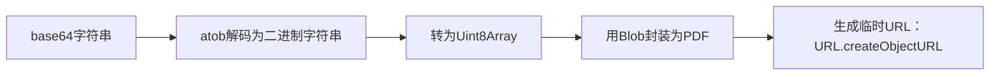

# PDFJS预览pdf文件

所有未写明之处可查阅[PDFJS官网](https://mozilla.github.io/pdf.js/)

## viewer.html预览pdf文件

使用pdfjs官方自带的viewer.html预览pdf文件


<demo vue="src/views/demo示例合集/PDF预览-viewer-html方式.vue" />

| name     | 说明                          |
| -------- | ----------------------------- |
| pdfjsUrl | 与/public下pdf.js源码地址有关 |
| fileUrl  | pdf文件地址                   |


::: danger 需要注释掉viewer.js中的同源校验，否则无法预览远程pdf文件和临时路径pdf文件

```js
// if (fileOrigin !== viewerOrigin) {
//   throw new Error("file origin does not match viewer's");
// }
```

:::

::: tip

1. 通常后端不会直接给pdf的真实地址，往往通过下载接口，返回`blob`数据，需要使用`URL.createObjectURL`转为临时路径
2. 还有后端可能会返回`base64`形式的数据，此时需要我们进行格式转换，转换流程如下：



:::

::: danger

1. `base64`的核心特点：每3个字节原始数据，编码为4个字符，故占用储存空间比原始二进制数据大约多`33%`。
2. `viewer.html`中内置了`分块加载`pdf文件数据的能力，当预览`超大pdf`时，应该让后端开发`分块传输`pdf文件接口，此时前端无需做任何操作，只需要通过`fileUrl`参数，传递pdf文件下载地址到`viewer.html`即可。
3. PDFJS会先向pdf文件地址发送`Request Method`为 `HEAD`的请求，让服务器返回响应头`header`，判断接口是否具备`分块下载`pdf文件数据的能力


:::

## 自定义ui界面

仅使用pdf.mjs与pdf.worker.mjs预览pdf文件

该方式需要自行实现视图部分，pdf.mjs与pdf.worker.mjs仅实现解析pdf文件内容，并提供render方法，将内容绘制到canvas中进行预览

故需要准备canvas画布，自行实现翻页、放大、滚动等所有功能

**简单示例** <demo vue="src/views/demo示例合集/PDF预览-集成pdfjs方式.vue" />
